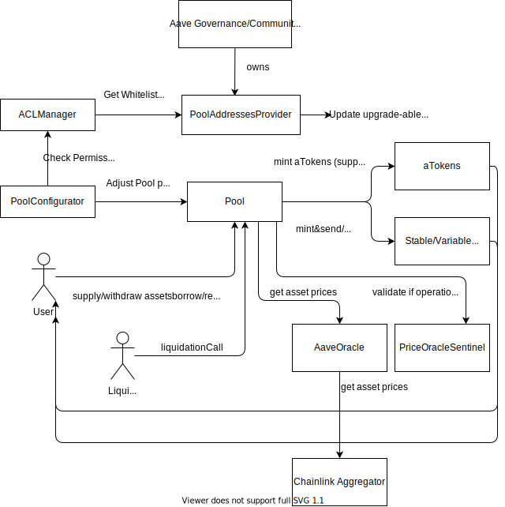

# Documentation

# Protocol
## New Features
* Portals - governance-approved bridges can burn aTokens on one chain and mint them on another (allowing for flow of liquidity)
* Efficiency Mode (eMode) - Higher loan-to-value (borrowing power) for assets correlated in price (e.g. stables, derivatives of same assets such as stEth and Eth)
* Price Oracle Sentinel - Grace period for liquidations and disabling of borrowing, e.g. to handle down time of sequencer on L2

## Protocol Security
* Chainlink Aggregators oracle for asset prices (e.g. for liquidation)
* OracleSentinel - in case Oracle or chain is failing be able to not execute liquidations as not correct data available to decide on
## Security
* PoolAddressesProvider owned by Aave Governance on Ethereum, other chains either Crosschain Governance Bridges or Community Multisigs! - contains allowed addresses for different ACL roles, e.g. to adjust pool parameters or upgrade smart contracts
* ACL Manager - access control list for who can execute which functions in contracts
* No fallback oracle - relies only

## TODOs
* Which chains with community multisigs?