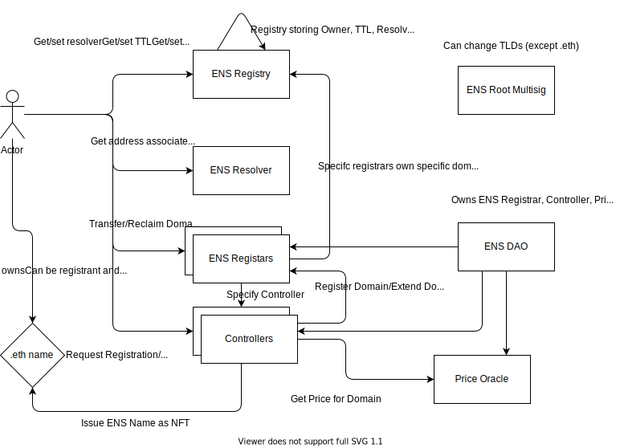

# Documentation

# Protocol
* Root Multisig can set/change Top Level Domains (TLDs) except .eth
* ENS DAO maintains other registrars, controllers
* Users can mint/extend subdomains of TLD (e.g. .eth)
* Users owning a subdomain like example.eth can mint/manage subdomains of it themselves (they are themselves Controller of the subdomain), e.g. foo.example.eth

* Treasury Address: 0xFe89cc7aBB2C4183683ab71653C4cdc9B02D44b7 (ETH Mainnet)

# TODOs
* DNS Registrar specifics?
* L2 Plans?