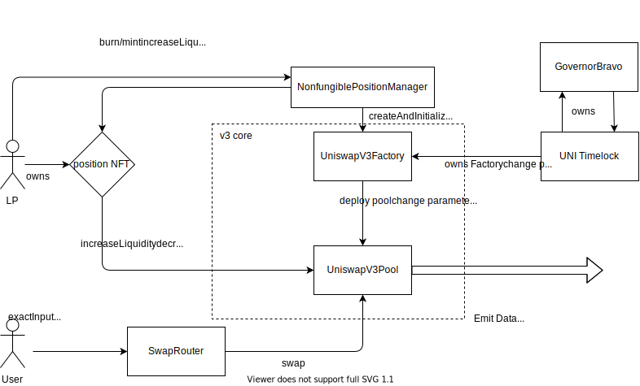

# Documentation

Overview Docs from Uniswap: https://docs.uniswap.org/protocol/reference/smart-contracts

Technical breakdown of Uniswap: https://starli.medium.com/uniswap-deep-dive-into-v3s-source-code-b141c1754bae

V3 Pool can only be adjusted by Factory owner - see https://github.com/Uniswap/v3-core/blob/8f3e4645a08850d2335ead3d1a8d0c64fa44f222/contracts/UniswapV3Pool.sol#L112 

TODO:
* Add Frontend Integration

Security: 
* UNI Timelock is protocol treasury, is governed using UNI token
* UniswapV3Factory owned by UNI Timelock
* Are contracts upgradeable - not according to white paper, how to determine in code (usually proxy implementation or interface)

Others
* Reliability
* Performance
